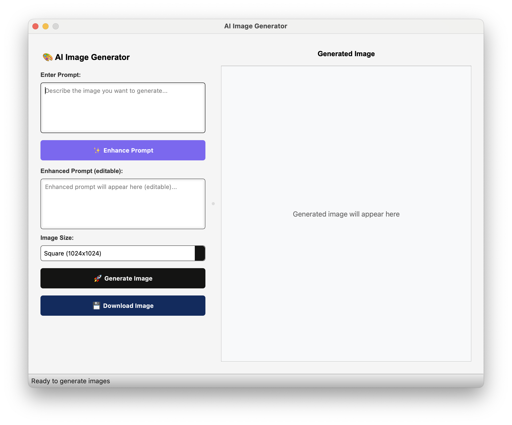

# AI Image Generator



This is a Python-based GUI application for generating AI images, built using PyQt5. **This application is currently designed for macOS only.** It leverages the Nebius AI platform for image generation and prompt enhancement.

## Features

*   **Image Generation**: Generate high-quality PNG images using various predefined or custom sizes.
*   **Prompt Enhancement**: Automatically enhance your image generation prompts to be more detailed, vivid, and creative using `microsoft/phi-4` model served by Nebius AI.
*   **API Key Management**: Securely store and retrieve your Nebius AI API key using `keyring` (macOS Keychain for macOS users).
*   **Image Download**: Save generated images to your local machine.
*   **User-Friendly Interface**: Intuitive graphical interface for easy interaction.

## Technologies Used

*   **PyQt5**: For building the graphical user interface.
*   **Nebius AI**:
    *   `black-forest-labs/flux-dev`: Image generation model.
    *   `microsoft/phi-4`: Prompt enhancement model.
    A single subscription gives you access to both models among others.
*   **`keyring`**: Secure storage of API keys.
*   **`requests`**: For making HTTP requests to the Nebius AI API.
*   **`Pillow` (PIL)**: For image manipulation and handling.
*   **`openai`**: Python client for OpenAI API (used for Nebius AI).

## Installation

To run this application, you need Python 3.12 or higher.

1.  **Clone the repository (if applicable):**
    ```bash
    git clone https://github.com/nasoma/ai-imagegen-gui.git
    cd ai-imagegen-gui
    ```

2.  **Install `uv` (recommended for fast dependency management):**
    ```bash
    pip install uv
    ```

3.  **Install dependencies:**
    It's recommended to use a virtual environment.
    ```bash
    python -m venv venv
    source venv/bin/activate
    uv pip install -e .
    ```
    This will install all dependencies listed in `pyproject.toml`.

## Usage

1.  **Run the application:**
    ```bash
    python gui.py
    ```

2.  **Configure API Key:**
    *   Upon first launch, or if the API key is not set, a settings dialog will appear.
    *   Enter your Nebius AI API key (obtained from Nebius AI Studio) in the settings dialog. Your key will be securely stored.

3.  **Generate Images:**
    *   Enter a descriptive prompt in the "Enter Prompt" text area.
    *   (Optional) Click "✨ Enhance Prompt" to get a more detailed and creative version of your prompt. You can edit the enhanced prompt if needed.
    *   Select an image size from the dropdown or choose "Custom Size" and enter dimensions (e.g., `800x600`).
    *   Click "🚀 Generate Image".
    *   The generated image will appear on the right panel.

4.  **Download Image:**
    *   After an image is generated, click "💾 Download Image" to save it to your desired location.

## Bundling the Application (macOS)

This application can be bundled into a standalone macOS application (`.app`) and then packaged into a Disk Image (`.dmg`) for easy distribution.

### Using `PyInstaller`

1.  **Install `PyInstaller`:**
    ```bash
    uv pip install pyinstaller
    ```
2.  **Generate the macOS application bundle:**
    ```bash
    pyinstaller --noconfirm --windowed --name "AI Image Generator" --add-data "MyIcon.icns:." --icon "MyIcon.icns" "gui.py"
    ```
    *   `--noconfirm`: Overwrite existing files without asking.
    *   `--windowed`: For GUI applications, prevents a console window from appearing.
    *   `--name "AI Image Generator"`: Sets the name of the generated application.
    *   `--add-data "MyIcon.icns:."`: Includes the icon file. Ensure `MyIcon.icns` is in your project root.
    *   `--icon "MyIcon.icns"`: Specifies the application icon.
    *   `"gui.py"`: Your main script file.

    This will create a `dist` folder containing the `AI Image Generator.app` bundle.

### Creating a Disk Image (`.dmg`) with `create-dmg`

To create a user-friendly installer for macOS, you can use `create-dmg`.

1.  **Install `create-dmg`:**
    If you don't have `create-dmg` installed, you can install it via Homebrew:
    ```bash
    brew install create-dmg
    ```
2.  **Create the DMG:**
    Navigate to your project's root directory and run:
    ```bash
    create-dmg \
      --volname "AI Image Generator Installer" \
      --volicon "MyIcon.icns" \
      --window-pos 200 120 \
      --window-size 800 400 \
      --icon-size 100 \
      --icon "AI Image Generator.app" 200 190 \
      --hide-extension "AI Image Generator.app" \
      --app-drop-link 600 185 \
      "dist/AI_Image_Generator_Installer.dmg" \
      "dist/"
    ```
    *   `--volname`: The name of the mounted disk image.
    *   `--volicon`: Icon for the mounted volume.
    *   `--window-pos`, `--window-size`: Position and size of the DMG window.
    *   `--icon-size`: Size of icons within the DMG.
    *   `--icon "AI Image Generator.app" 200 190`: Places the application icon at specified coordinates.
    *   `--hide-extension`: Hides the `.app` extension.
    *   `--app-drop-link 600 185`: Creates a drag-and-drop link to the Applications folder at specified coordinates.
    *   `"dist/AI_Image_Generator_Installer.dmg"`: Output path and filename for the DMG.
    *   `"dist/"`: The source directory containing your `.app` bundle.

    This will create a `.dmg` file in your `dist` directory, ready for distribution.

## Development Notes

*   The application uses `keyring` for secure API key storage. On macOS, this typically uses the Keychain.
*   Image generation and prompt enhancement are handled in separate QThreads (`APIWorker` and `PromptEnhancerWorker`) to keep the GUI responsive.
*   Error handling includes warnings for missing API keys, invalid image sizes, and API errors.

## License

This project is licensed under the MIT License.
